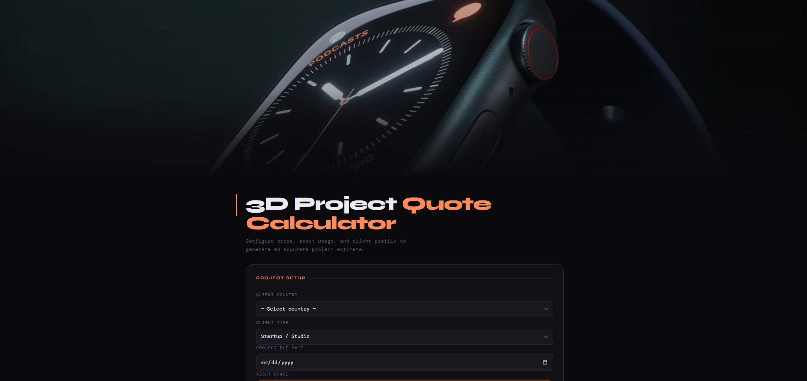

# 3D Project Quote Calculator

A simple browser tool for **3D artists and freelancers** to estimate the price of a project based on tasks, complexity, timeline, and client budget.

This calculator helps create **consistent and transparent quotes** for commissions and production work.



---

# What This Tool Does

The calculator lets you estimate pricing by selecting the work required for a project.

Examples of things you can include:

* Modeling
* Texturing / UVs
* Shaders / Materials
* Rigging
* Animation
* Blueprint / Logic systems
* VFX / Particles

Each task includes **complexity levels**, allowing the quote to reflect the amount of work required.

You can also adjust:

* Client budget tier
* Rush timeline
* Asset reuse vs custom work
* IP ownership

---

# How To Use

1. Download or clone the repository
2. Open **index.html** in your browser
3. Select the tasks needed for your project
4. Click **Calculate Quote**

The tool will generate an estimated price.

No installation or server is required.

---

# Changing Your Prices

All pricing values are stored in **config.json** so you can easily customize them.

Example:

```json
{
  "baseRates": {
    "modeling": 50,
    "texturing": 20,
    "shaders": 40,
    "rigging": 100,
    "animation": 100
  },
  "rushMultiplier": 1.4,
  "ipDiscountMultiplier": 0.85
}
```

You can change these numbers to match your own rates.

Example adjustments:

* Increase `modeling` if you charge more for modeling work
* Increase `rushMultiplier` if you charge more for urgent deadlines
* Change `ipDiscountMultiplier` if you want a different discount when keeping IP rights

After editing the file, refresh the page and the new prices will apply automatically.

---

# Who This Is For

* Freelance 3D artists
* Game artists
* VR / AR artists
* Product visualization artists
* Anyone doing 3D commissions

---

# License

MIT License

Copyright (c) 2026 Anthony

Free to use, modify, and share. Please keep the original license notice.
